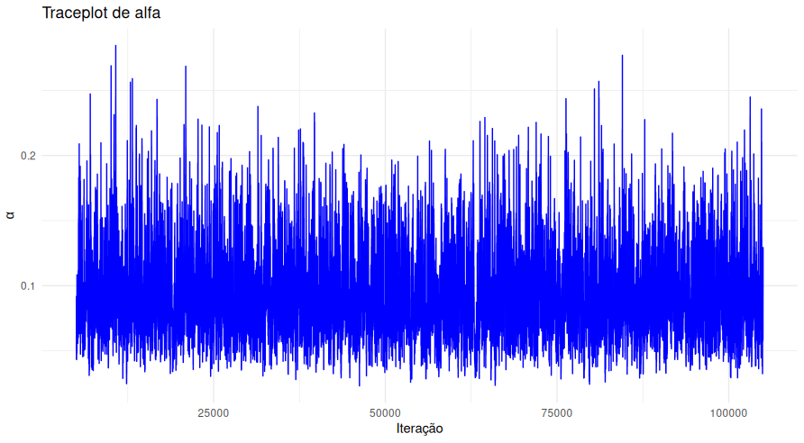
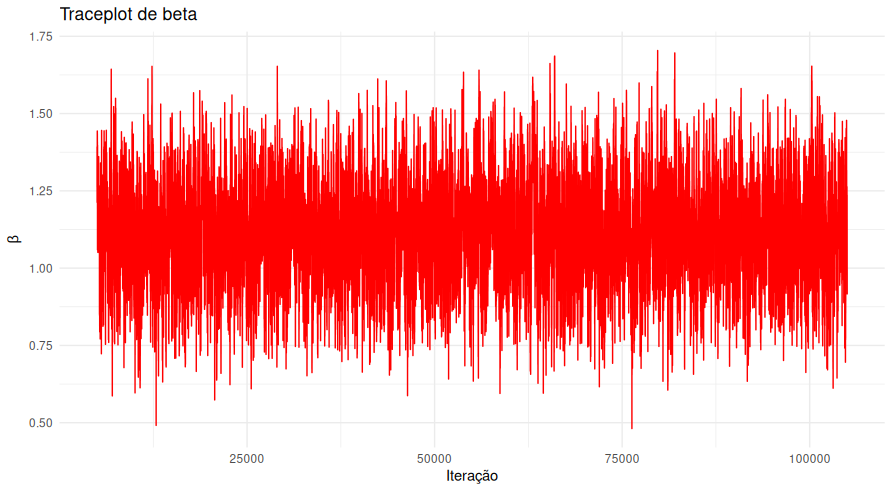
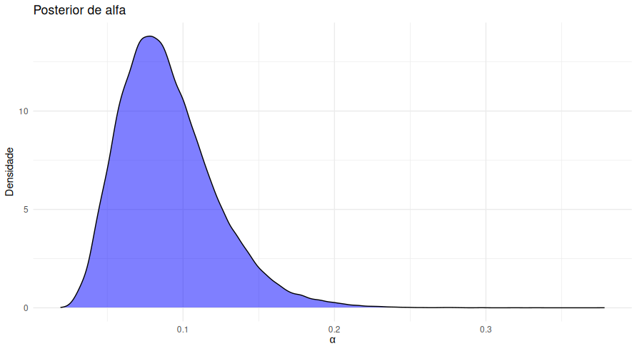
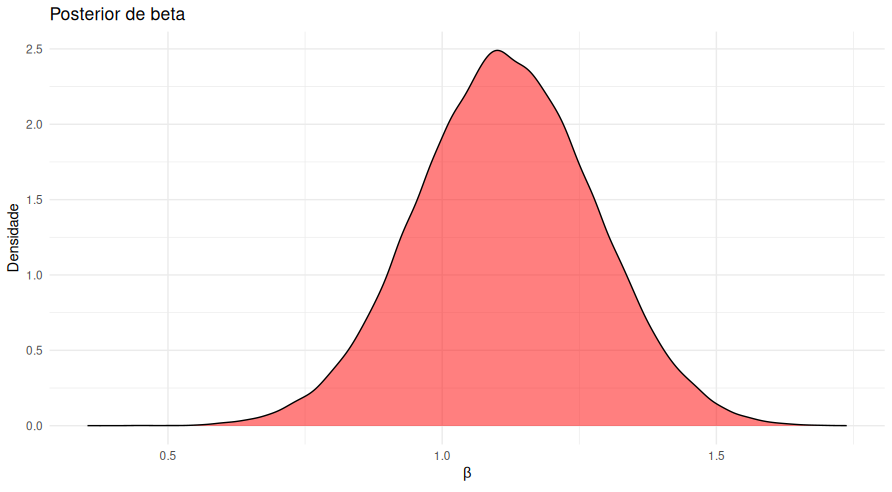
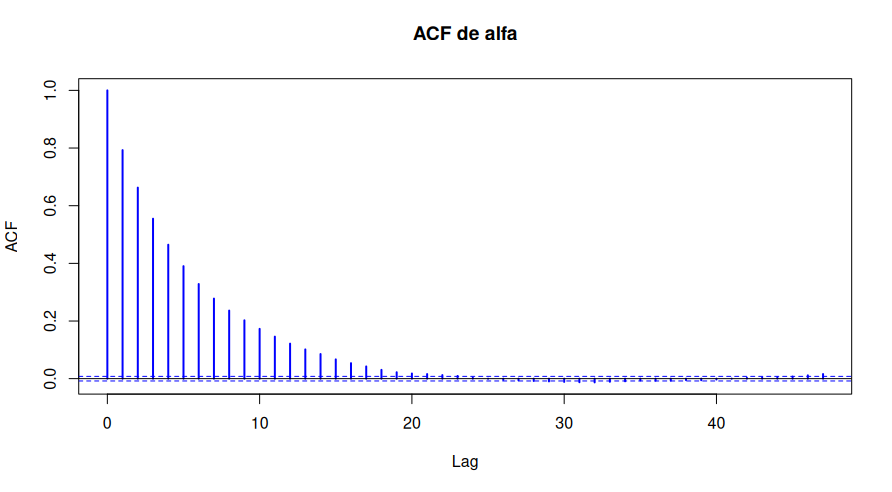
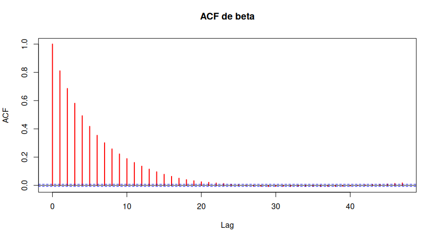

# Bayesian Analysis of the Gompertz Distribution using MCMC

Author: Guilherme Henrique Hispagol Bicho  
Date: 2026

---

# Overview

This project presents a **Bayesian estimation of the parameters of the Gompertz distribution** using **Markov Chain Monte Carlo (MCMC)** methods.

The Gompertz distribution is widely used in:

- Survival analysis
- Reliability engineering
- Demography
- Lifetime modeling

The objective is to estimate the posterior distribution of the model parameters and evaluate the convergence and efficiency of the MCMC algorithm.

---

# Gompertz Distribution

The Gompertz distribution is defined by two parameters:

- **α (alpha)** – shape parameter
- **β (beta)** – scale parameter

The hazard function of the Gompertz model is:

$h(t) = \alpha e^{\beta t}$

This implies an **exponentially increasing hazard rate**, which is common in aging and reliability processes.

---

# Bayesian Model

The posterior distribution is given by:

$\pi(\alpha, \beta | x) \propto L(\alpha, \beta | x)\pi(\alpha)\pi(\beta)$

where:

- $L(\alpha,\beta|x)$ is the likelihood
- $\pi(\alpha)$ and $\pi(\beta)$ are prior distributions

Gamma priors were used for both parameters.

The posterior was sampled using **Metropolis-Hastings MCMC**.

---

# MCMC Configuration

| Parameter | Value |
|-----------|------|
Iterations | 105000 |
Burn-in | 5000 |
Chains | 3 |
Thinning | 5 |

Multiple chains were used to ensure convergence diagnostics.

---

# Acceptance Rates

| Chain | α | β |
|------|----|----|
1 | 0.34456 | 0.31180 |
2 | 0.34440 | 0.31453 |
3 | 0.34377 | 0.31342 |

Acceptance rates between **20% and 40%** indicate a well-calibrated Metropolis algorithm.

---

# Convergence Diagnostics

The **Gelman-Rubin diagnostic (PSRF)** was used.

| Parameter | PSRF |
|----------|------|
α | 1.00 |
β | 1.00 |

Values close to **1** indicate that all chains converged to the same posterior distribution.

---

# Effective Sample Size

| Parameter | ESS |
|----------|------|
α | 5644 |
β | 5225 |

These values indicate that the posterior sample is sufficiently independent for reliable inference.

---

# Posterior Estimates

| Parameter | Mean | SD | 2.5% | 97.5% |
|----------|------|------|------|------|
α | 0.09024 | 0.03185 | 0.04183 | 0.16469 |
β | 1.11546 | 0.16111 | 0.79815 | 1.43093 |

These values summarize the posterior distribution obtained from the MCMC simulation.

---

# MCMC Diagnostics

To assess the quality of the Markov Chain Monte Carlo sampling, the classical **Bayesian diagnostic triad** was analyzed:

1. Traceplots
2. Posterior densities
3. Autocorrelation functions (ACF)

These diagnostics help evaluate convergence, mixing, and independence of the simulated chains.

---

# Traceplots

Traceplots show the evolution of sampled values across iterations.

## Alpha Traceplot



Interpretation:

The chains oscillate around a stable mean and show no visible trend, indicating that the Markov chain reached stationarity.

---

## Beta Traceplot



Interpretation:

The chains mix well across the parameter space, suggesting good convergence properties.

---

# Posterior Densities

## Posterior Density of α



Interpretation:

The posterior distribution is unimodal and concentrated, indicating a stable parameter estimate.

---

## Posterior Density of β



Interpretation:

The posterior distribution suggests a well-defined peak around the posterior mean.

---

# Autocorrelation Analysis (ACF)

Autocorrelation functions measure the dependence between MCMC samples.

Lower autocorrelation implies better sampling efficiency.

## ACF for α



Interpretation:

Autocorrelation decreases rapidly, indicating that the thinning and sampling strategy produced approximately independent samples.

---

## ACF for β



Interpretation:

The autocorrelation decays quickly across lags, suggesting that the effective sample size is adequate.

---

## Bayesian Inference Framework

Bayesian inference combines prior knowledge with information from the data through the likelihood function.

The posterior distribution is obtained using Bayes' theorem.


---

# Interpretation of Results

The posterior estimates suggest:

- **α ≈ 0.09**
- **β ≈ 1.11**

This implies a **hazard rate that increases exponentially over time**, which is typical for aging or deterioration processes.

The diagnostic results indicate:

- good chain mixing
- convergence across chains
- sufficient effective sample size

Therefore, the Bayesian model provides a stable and reliable estimation of the Gompertz parameters.

---

# Technologies Used

- R
- coda
- ggplot2
- MCMC (Metropolis_Hasting)
- Bayesian inference

---

# Reproducibility

To reproduce the analysis:

```r
source("code/gompertz_mcmc.R")
